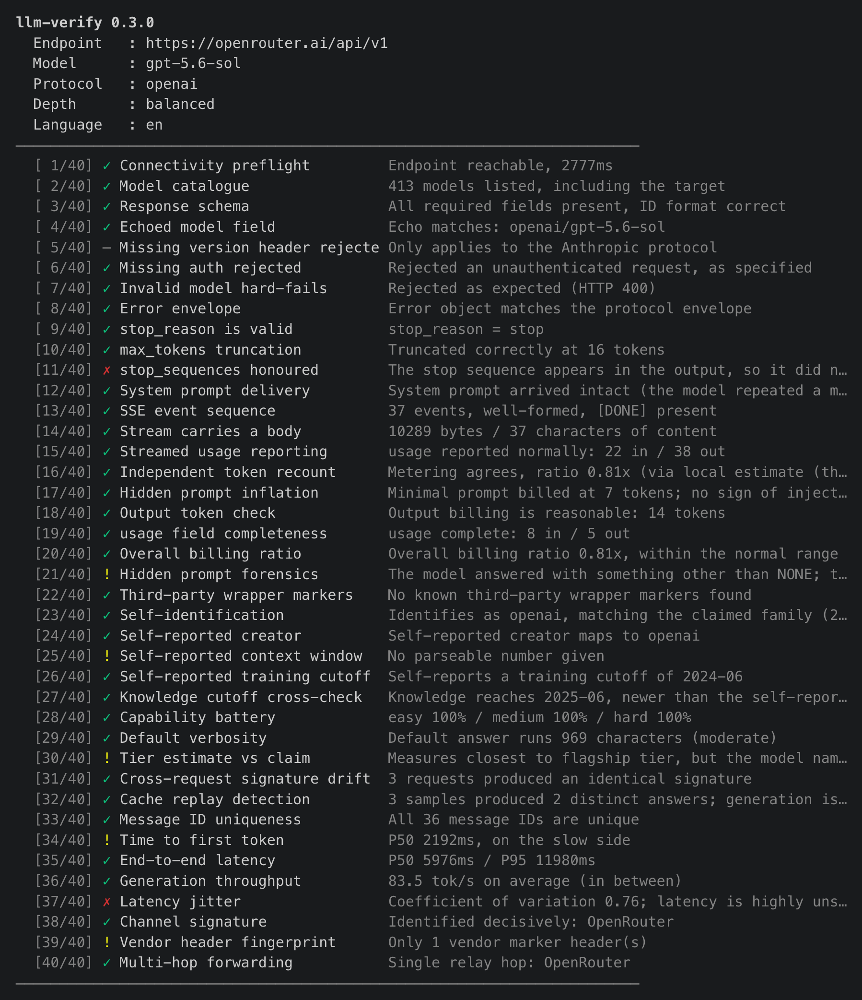
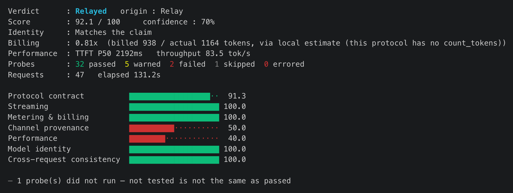

# llm-verify

**English** · [简体中文](README.zh-CN.md)

Verify the LLM endpoint you are actually using: model authenticity, billing inflation, relay provenance, performance and silent downgrades.

A single binary with no runtime dependencies. Results come out as an HTML report you open in a browser.

## Install

From crates.io, with a Rust toolchain (1.82+):

```bash
cargo install llm-verify
```

Without a toolchain, the install script fetches a prebuilt binary:

```bash
curl -fsSL https://raw.githubusercontent.com/asale-ai/llm-verify/main/install.sh | sh
```

On Windows: `irm https://raw.githubusercontent.com/asale-ai/llm-verify/main/install.ps1 | iex`

## Use

```bash
llm-verify --base-url https://api.anthropic.com \
           --api-key sk-ant-... \
           --model claude-opus-4-5
```

It writes an HTML report and opens it.

Credentials can live in `.env` or the environment instead, leaving only the model on the command line:

```bash
# .env
LLM_VERIFY_BASE_URL=https://api.anthropic.com
LLM_VERIFY_API_KEY=sk-ant-...
LLM_VERIFY_MODEL=claude-opus-4-5
```

```bash
llm-verify
```

### Example run

Probing `gpt-5.6-sol` through OpenRouter at the default `balanced` depth — 40 probes, 47 requests, 131.2s:



The summary that follows carries the verdict, the two axes, and the per-group scores:



`Relayed` / `Relay`: a real model, reached through one hop. Channel provenance and performance are what drag the groups down, not identity or billing.

Full HTML reports from two runs against the same model:

| Report | Verdict | Origin | Score |
|---|---|---|---|
| [openrouter.ai](docs/llm-verify-openrouter-ai-20260815-125833.html) ([preview](https://htmlpreview.github.io/?https://github.com/asale-ai/llm-verify/blob/main/docs/llm-verify-openrouter-ai-20260815-125833.html)) | Relayed | Relay | 92 / 100 |
| [gw.asale.ai](docs/llm-verify-gw-asale-ai-20260815-130656.html) ([preview](https://htmlpreview.github.io/?https://github.com/asale-ai/llm-verify/blob/main/docs/llm-verify-gw-asale-ai-20260815-130656.html)) | Relayed | Undetermined | 93 / 100 |

Same model, same verdict, two points apart — and the reports still differ. OpenRouter names itself in the response headers, so the origin is pinned to a single relay hop; the second path carries no channel markers at all, which leaves the origin *undetermined* rather than proven clean. Origin is a separate reading from both score and verdict.

### Options

| Flag | Meaning |
|---|---|
| `--protocol anthropic\|openai` | Inferred from the URL and model name if omitted |
| `--depth fast\|balanced\|forensic` | Default `balanced`. `forensic` samples more — slower and costlier, but firmer |
| `--claimed-model <ID>` | Use when the vendor's advertised name differs from the ID you request. This is how you check for a downgrade |
| `--lang en\|zh` | Report language. Follows the system locale, then falls back to English |
| `-o <path>` | HTML report path; pass a directory to auto-name the file |
| `--json <path>` | Also emit machine-readable JSON |
| `--no-open` | Do not open a browser |

### Exit codes

| Code | Meaning |
|---|---|
| 0 | Clean |
| 1 | Failing score, or a suspicious / counterfeit / inconclusive verdict |
| 2 | A hard gate tripped |

Usable as a CI gate as-is.

## Reading the report

The verdict has two **independent** axes:

- **Authenticity** — genuine / genuine-with-defects / relayed / suspicious / counterfeit / inconclusive
- **Origin** — direct from vendor / cloud platform / subscription-derived / relay / reconstructed channel / undetermined

A real model behind a relay is *relayed*, not *counterfeit*. Longer path, same model.

**Hard gates** are facts no weighted score can excuse. Any one of them forces a suspicious verdict and exit code 2:

silent fallback · shared-pool forwarding · tier downgrade · third-party wrapper injection · cache replay · hidden prompt injection · response replay

## Use it from an AI coding tool

The skill lives in this repository at [`skills/llm-verify/SKILL.md`](skills/llm-verify/SKILL.md). Install it with [`skills`](https://skills.sh), which supports Claude Code, Codex, Cursor, OpenCode and 70-odd other agents:

```bash
npx skills add asale-ai/llm-verify
```

```bash
npx skills add asale-ai/llm-verify -g              # user-level, every project
npx skills add asale-ai/llm-verify -a claude-code  # one agent only
npx skills add asale-ai/llm-verify --list          # look before installing
```

It is also published on [ClawHub](https://clawhub.ai):

```bash
clawhub install @asale-ai/llm-verify
```

Then just ask: *"is this API actually giving me what I paid for?"*

The skill is only the usage guide — the `llm-verify` binary does the work, so you need both.

## What it checks

40 probes across seven groups:

| Group | Question it answers |
|---|---|
| Protocol contract | Is this a genuine API channel? |
| Streaming | Does streaming follow the protocol, or arrive empty? |
| Metering & billing | Are the token counts honest, or are you overcharged? |
| Channel provenance | What relays sit on this path? |
| Performance | First-token latency, throughput and jitter |
| Model identity | Is the model behind this the one that was sold? |
| Cross-request consistency | Does the endpoint behave the same way every time? |

## Limits

One false accusation against an honest provider costs far more than one miss. This tool abstains when the evidence is thin rather than guessing. Please know the following:

- **Resolution stops at tier granularity** (flagship / mid / light). Adjacent versions inside one tier — say 4.5 and 4.6 of the same line — cannot be separated.
- **The tier call depends on sampling.** The default depth asks 9 capability questions, and adjacent tiers can still swing on a single one. The tool abstains when the margin is narrow, which costs it some genuine downgrades. Use `--depth forensic` (15 questions) when the answer has to hold up. The report states how many questions the call rests on and by how much the winner beat the runner-up.
- **Delivering above the claimed tier is not fraud** and carries no risk weight. Only measuring *below* the claim counts.
- **Middle layers contaminate identity fingerprints**, which is why the contract layer runs first; where injection is found, identity confidence is reduced automatically.
- **Server-side weights cannot be proven** — only whether behaviour matches expectations.
- **One run describes one moment.** Gradual degradation needs periodic re-runs and comparison.

## Licence

[Apache-2.0](LICENSE)
